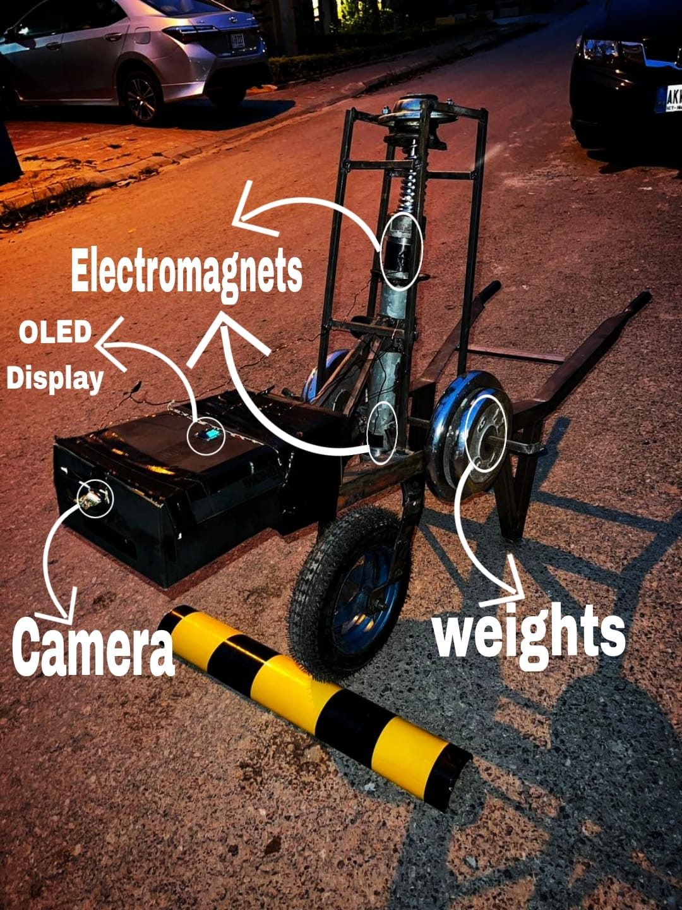
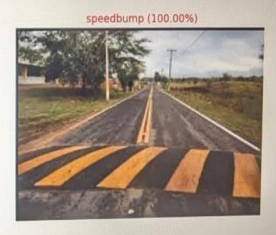
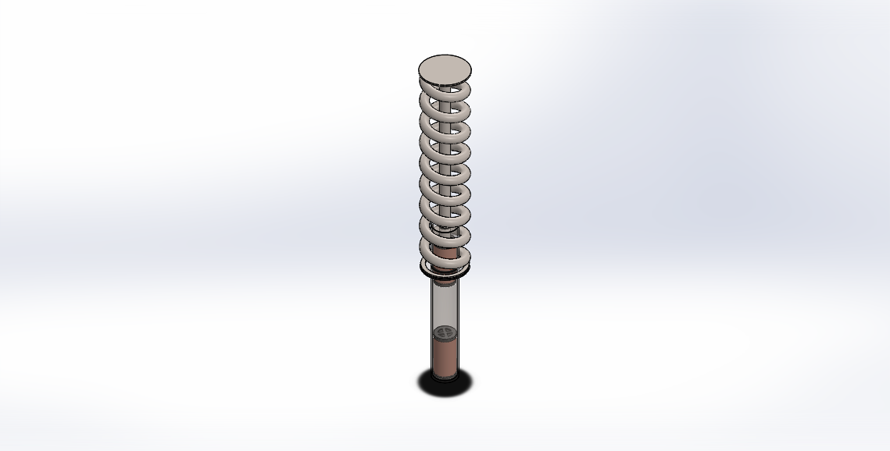

# AI-Driven Electromagnetic Adaptive Shock Absorber for Automotive Applications


---

## Overview

Traditional hydraulic shock absorbers provide fixed damping characteristics regardless of road conditions, forcing engineers to compromise between ride comfort and vehicle handling. This project presents an **AI-driven electromagnetic adaptive shock absorber** capable of adjusting its damping characteristics in real time according to the terrain ahead.

The proposed system integrates computer vision, embedded control, electromagnetic actuation, and mathematical modelling into a single intelligent suspension framework. A Raspberry Pi 5 equipped with a camera performs real-time terrain classification using a trained YOLOv8 model. The detected terrain class is transmitted to an STM32F103 microcontroller, which dynamically regulates the current supplied to custom-designed electromagnets. The varying magnetic force modifies the damping characteristics of the suspension, enabling improved comfort and stability across different driving surfaces.

The project combines mechanical design, finite element simulation, artificial intelligence, embedded systems, and control engineering to demonstrate an adaptive suspension prototype suitable for future intelligent automotive systems.

---

## Key Features

* AI-based terrain classification using YOLOv8
* Real-time terrain recognition on Raspberry Pi 5
* Adaptive damping using electromagnets
* STM32-based embedded control system
* PWM current regulation through IBT-2 H-Bridge
* Closed-loop control using MPU6050 feedback
* Custom electromagnet design using MATLAB
* CAD modelling using SolidWorks
* Electromagnetic simulations using ANSYS Maxwell
* Modular hardware architecture for future automotive integration

---

## System Architecture

```
                Camera
                   │
                   ▼
        Raspberry Pi 5 (YOLOv8)
                   │
         Terrain Classification
                   │
               GPIO Signal
                   │
                   ▼
          STM32F103 Blue Pill
                   │
      PWM Current Control Logic
                   │
                   ▼
        BTS7960 / IBT-2 H-Bridge
                   │
                   ▼
        Electromagnetic Actuator
                   │
          Variable Damping Force
                   │
                   ▼
          Shock Absorber Assembly

          ▲
          │
 MPU6050 Accelerometer Feedback
```

---

## Project Objectives

The primary objectives of this project include:

* Develop an AI-based terrain classification system capable of recognizing asphalt, gravel, and speed bumps.
* Design an adaptive electromagnetic shock absorber capable of modifying damping characteristics in real time.
* Integrate computer vision with embedded control hardware.
* Develop mathematical models for electromagnet optimisation.
* Validate the proposed design using simulations and prototype testing.

---

## Technologies Used

### Artificial Intelligence

* YOLOv8 Classification
* Python
* OpenCV
* Ultralytics

### Embedded Systems

* Raspberry Pi 5
* STM32F103 Blue Pill
* UART Communication
* PWM Control

### Electronics

* BTS7960 (IBT-2) H-Bridge
* ACS712 Current Sensor
* MPU6050 Accelerometer
* LM7805 Voltage Regulator

### Mechanical Design

* Electromagnet Design
* Hydraulic Shock Absorber Modification
* Floating Permanent Magnet
* Custom Prototype Fabrication

### Engineering Software

* MATLAB
* SolidWorks
* ANSYS Maxwell
* Arduino IDE
* STM32CubeProgrammer

---

## Repository Structure

```
AI-Driven-Electromagnetic-Adaptive-Shock-Absorber
│
├── ai-terrain-classification/
│   ├── inference/
│   ├── training/
│   ├── results/
│   └──  best.pt
│
├── embedded/
│   ├── RaspberryPi/
│   └──  STM32/
│
├── matlab/
│
├── cad/
│
├── circuit/
│
├── modeling and simulations/
│
├── docs/
│
└── media/
```
---

# Hardware Components

| Component                     | Purpose                                        |
| ----------------------------- | ---------------------------------------------- |
| Raspberry Pi 5                | Runs the YOLOv8 terrain classification model   |
| Raspberry Pi Camera V2 (8 MP) | Captures real-time road images                 |
| STM32F103 Blue Pill           | Controls adaptive damping logic                |
| IBT-2 (BTS7960) H-Bridge      | Drives the electromagnets using PWM            |
| ACS712 30A Current Sensor     | Measures electromagnet current                 |
| MPU6050 Accelerometer         | Provides stroke velocity and position feedback |
| LM7805 Voltage Regulator      | Regulates power for electronics                |
| 12V Battery                   | Main power source                              |
| Custom Electromagnets         | Generate variable magnetic damping             |
| Floating Neodymium Magnet     | Provides repulsive magnetic force              |
| Modified Shock Absorber       | Mechanical suspension prototype                |

---

# Software Stack

### Artificial Intelligence

* Python
* Ultralytics YOLOv8
* OpenCV
* NumPy

### Embedded Development

* Arduino IDE
* STM32 Arduino Core
* STM32CubeProgrammer

### Engineering Software

* MATLAB
* SolidWorks
* ANSYS Maxwell

---

# AI Terrain Classification

The perception module of the system is implemented on a **Raspberry Pi 5** using a YOLOv8 image classification model trained to recognize three road conditions:

* Asphalt
* Gravel
* Speed Bump

The Raspberry Pi continuously captures images from the Pi Camera and performs inference in real time. Once a terrain class is identified, the predicted class is transmitted through UART to the STM32 microcontroller.

Unlike conventional suspension systems that only react after encountering a disturbance, this approach enables **predictive damping control**, allowing the suspension to prepare before the vehicle reaches the detected terrain.

---

# Adaptive Damping Control

The STM32F103 Blue Pill serves as the real-time control unit.

After receiving the terrain classification from the Raspberry Pi, it adjusts the PWM duty cycle driving the BTS7960 H-Bridge.

Different terrains require different damping characteristics.

| Terrain    | Control Strategy                      |
| ---------- | ------------------------------------- |
| Asphalt    | Minimum or zero electromagnet current |
| Gravel     | Medium current for moderate damping   |
| Speed Bump | High current for maximum damping      |

The MPU6050 accelerometer continuously measures piston movement and stroke velocity, allowing the controller to adjust damping dynamically during operation.

---

# Electromagnet Design

The damping mechanism replaces conventional passive damping with magnetic repulsion.

The prototype consists of:

* Two custom-designed electromagnets
* Soft iron cores
* Copper wire windings
* Floating neodymium magnet
* Hydraulic shock absorber body

Electromagnet dimensions were obtained through analytical calculations and optimized using MATLAB before validation in ANSYS Maxwell.

The final design balances:

* Magnetic force
* Current consumption
* Coil resistance
* Wire gauge
* Air gap
* Physical size constraints

---

# MATLAB Modelling

Several mathematical models were developed to optimize the electromagnet design, including:

* Magnetic force calculations
* Coil turn optimization
* Wire gauge selection
* Air-gap analysis
* Current limitation
* Saturation analysis
* Fringing correction
* Coil resistance estimation

MATLAB simulations were used to determine the optimum electromagnet geometry while satisfying mechanical constraints imposed by the modified shock absorber.

---

# ANSYS Maxwell Simulation

Finite Element Analysis (FEA) was performed using ANSYS Maxwell to validate the analytical calculations.

Simulation objectives included:

* Magnetic flux distribution
* Fringing effects
* Core saturation
* Field intensity
* Electromagnetic force validation

Simulation results closely matched the theoretical calculations and confirmed the suitability of the proposed electromagnet design.

---

# CAD Design

The complete suspension prototype was designed in SolidWorks.

The CAD model includes:

* Shock absorber cylinder
* Electromagnets
* Floating permanent magnet
* Mechanical spring
* Piston assembly
* Structural supports

The CAD model ensured correct fitment before fabrication and served as the basis for prototype manufacturing.

---

# Experimental Setup

The experimental platform consists of three primary subsystems.

### 1. Sensing

* Raspberry Pi 5
* Pi Camera

Responsible for real-time terrain perception.

---

### 2. Control

* STM32F103 Blue Pill
* MPU6050
* ACS712

Responsible for adaptive current regulation.

---

### 3. Actuation

* IBT-2 H-Bridge
* Electromagnets
* Floating Magnet
* Shock Absorber

Responsible for generating adaptive damping forces based on terrain classification.

---

# System Workflow

```text
Road Surface
      │
      ▼
Pi Camera
      │
      ▼
YOLOv8 Terrain Classification
      │
      ▼
GPIO Communication
      │
      ▼
STM32 Controller
      │
      ▼
PWM Current Generation
      │
      ▼
IBT-2 H-Bridge
      │
      ▼
Electromagnets
      │
      ▼
Adaptive Shock Absorber
      ▲
      │
MPU6050 Feedback
```
---

# Results

The developed prototype successfully demonstrated the feasibility of integrating artificial intelligence with an adaptive electromagnetic suspension system.

## AI Terrain Classification

The YOLOv8 terrain classification model was deployed on a Raspberry Pi 5 and achieved:

* **90% terrain classification accuracy**
* **Real-time inference at approximately 15 FPS**
* Recognition of three terrain classes:

  * Asphalt
  * Gravel
  * Speed Bump

The terrain information was transmitted to the STM32 controller with minimal latency, enabling predictive suspension control.

---

## Electromagnetic Suspension Performance

The prototype successfully demonstrated:

* Real-time adaptive damping
* Variable current control of electromagnets
* Stable communication between Raspberry Pi and STM32
* Closed-loop feedback using the MPU6050 accelerometer
* Successful integration of AI perception with embedded control

---

## Simulation Validation

The analytical MATLAB calculations were validated through ANSYS Maxwell simulations.

The simulation confirmed:

* Magnetic flux distribution
* Electromagnetic force generation
* Absence of significant magnetic core saturation
* Acceptable fringing characteristics

---

# Project Gallery


| Prototype                       | AI Detection                            |
| ------------------------------- | --------------------------------------- |
|  |  |

| CAD Model                       | Experimental Setup          |
| ------------------------------- | --------------------------- |
|  |  |

| STM32 Circuit                       | Electromagnet Assembly              |
| ----------------------------------- | ----------------------------------- |
|  |  |

---

# Repository Contents

```text
📂 AI-Driven-Electromagnetic-Adaptive-Shock-Absorber

├── ai-terrain-classification/
│   ├── inference/
│   ├── training/
│   ├── results/
│   ├── best.pt
│   └── DATASET.md
│
├── embedded/
│   ├── RaspberryPi/
│   ├── STM32/
│   └── ESP32/
│
├── matlab/
│
├── cad/
│
├── circuit/
│
├── simulations/
│
├── calculations/
│
├── docs/
│
└── media/
```

---

# Dataset

The original training dataset is **not included** in this repository because of its large size.

The model was trained using three terrain categories:

* Asphalt
* Gravel
* Speed Bump

The repository includes:

* Trained model (`best.pt`)
* Training metrics
* Confusion matrices
* Validation results

Users may retrain the model using their own dataset organized in the same class structure.

---

# Future Improvements

Potential future enhancements include:

* Closed-loop PID or fuzzy logic control
* Magnetorheological (MR) fluid integration
* Optimized electromagnet geometry (E-core design)
* Thermal management for sustained high-current operation
* Expanded terrain classes (mud, sand, potholes, snow, wet roads)
* Real vehicle testing and validation

---

# Authors

**Final Year Project**

**Department of Mechatronics Engineering**

**Air University, Islamabad**

### Group Members

* Umair Mubashir
* Saad Bin Awais
* Muhammad Maaz

**Project Supervisor**

Dr. Rana Iqtidar Shakoor

---

# Acknowledgements

The authors would like to express their sincere gratitude to the Department of Mechatronics Engineering, Air University, Islamabad, for providing the facilities and academic environment necessary to complete this work.

Special thanks are extended to the project supervisor for continuous guidance and technical support throughout the development of this project.

---

# Citation

If you use this work in your research, please cite:

```text
Muhammad Maaz, Umair Mubashir, and Saad Bin Awais,
"AI-Driven Electromagnetic Adaptive Shock Absorber for Automotive Applications,"
Final Year Project,
Department of Mechatronics Engineering,
Air University, Islamabad,
2026.
```

---

# License

This project is licensed under the MIT License.

See the `LICENSE` file for details.

---

# Contact

For questions, suggestions, or collaboration opportunities, feel free to open an issue or submit a pull request.

---

## ⭐ If you found this repository useful, consider giving it a star!
